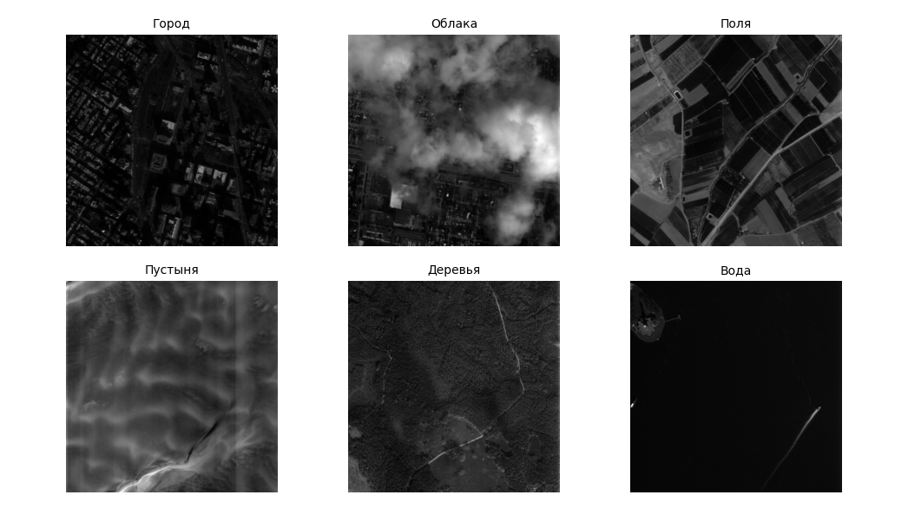
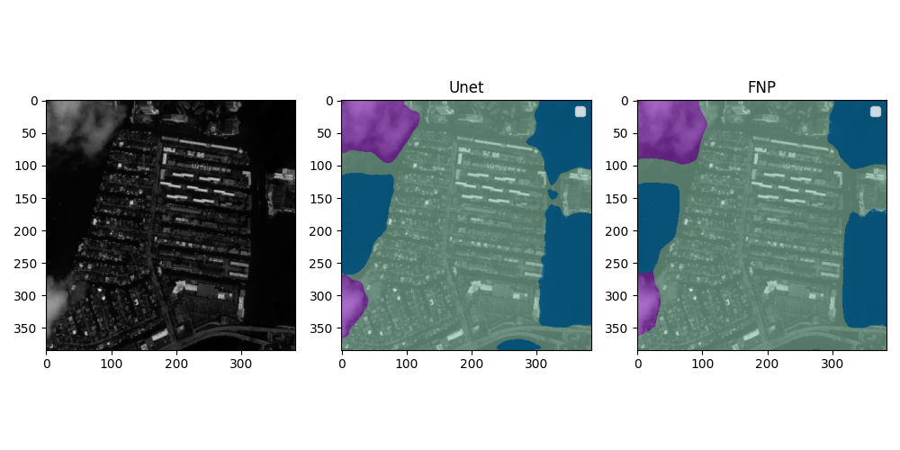
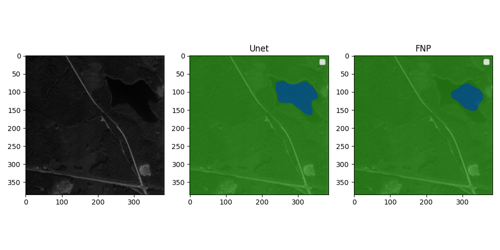

# Сегментация спутниковых снимков на основе сверточных нейронных сетей

📡🧠 Этот проект посвящён разработке и обучению моделей глубокого обучения для задачи семантической сегментации спутниковых изображений. Модель, способна автоматически определять различные типы ландшафта (город, водоемы, леса, облака, пустыня, поля) на спутниковых изображениях. 

### Примеры классов

## 🔍 Описание
Для обучения использовался собственный датасет размеченный с помощюь CVAT. Ахитектуры использовались U-Net и FPN. Также производится нормализация и аугментация изображений. Модель работает с файлами формата .tiff

### Примеры результатов сегментации

Результат авторазметки города с водой и облаками

Результат авторазметки леса с озером

### 📊 Метрики качества на тестовай выборке

| Метрика |  U-Net   |    FPN   
|---------|----------|----------
| IoU     | 0.91     | 0.90
|Dice loss| 0.05     | 0.60

## 🛠️ Технологии

- Python 3.10+
- PyTorch
- OpenCV
- Rasterio
- NumPy
- Albumentations (аугментации)
- Matplotlib (визуализация)
- Segmentation models pytorch

