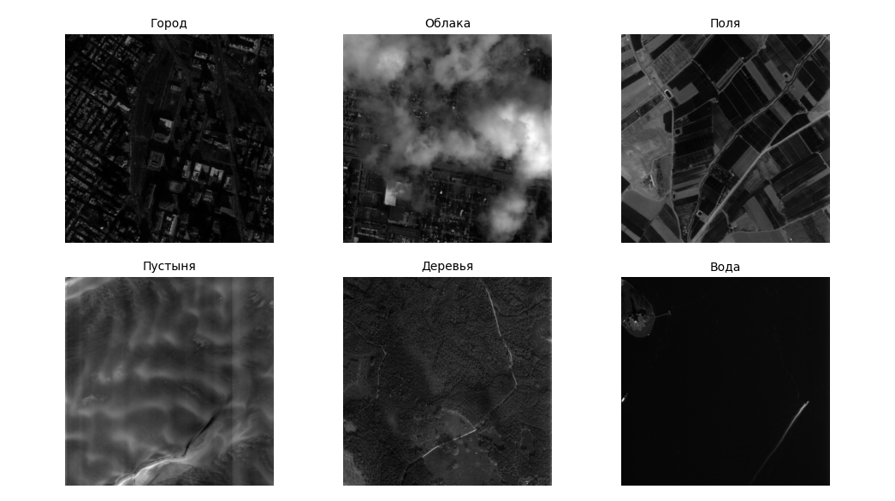
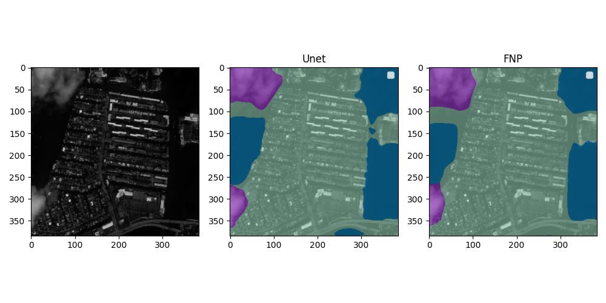
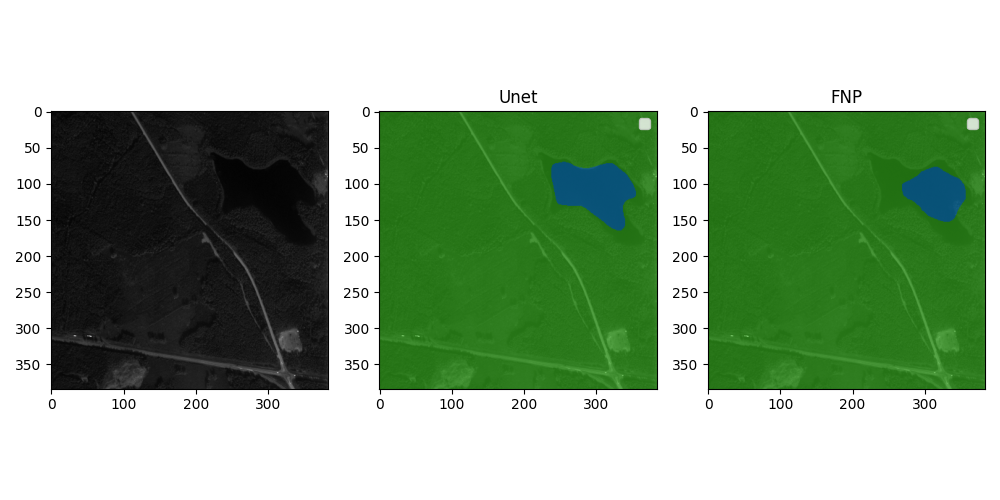

# Сегментация спутниковых снимков на основе сверточных нейронных сетей

📡🧠 Этот проект посвящён разработке и обучению моделей глубокого обучения для задачи семантической сегментации спутниковых изображений. Модель, способна автоматически определять различные типы ландшафта (город, водоемы, леса, облака, пустыня, поля) на спутниковых изображениях. 

### Примеры классов

## 🔍 Описание
Для обучения использовался собственный датасет размеченный с помощюь CVAT. Использовалась архитектура U-Net. Также производится нормализация и аугментация изображений. Модель работает с файлами формата .tiff

### Примеры результатов сегментации

Результат авторазметки города с водой и облаками

Результат авторазметки леса с озером

### 📊 Метрики качества на тестовай выборке

| Метрика |  U-Net   
|---------|----------
| IoU     | 0.94    
|Dice loss| 0.03     

## 📊 Результаты нагрузочного тестирования

Тестирования производилось на снимках количеством 1367 штук

| Вычислительное устройсво| Время выполнения (секунд)| Средняя скорость (изображений/секунда)
|-------------------------|--------------------------|---------------------
| CPU                     | 296.27                   | 4.61
| GPU                     | 55.30                    | 24.71

*CPU -- AMD RYZEN 5

*GPU -- Т4 (Google Colab)

Результаты тестирования на С++
https://github.com/0rpheus-0/C-speedtest-geo-segmentetion

## 🛠️ Технологии

- Python 3.10+
- PyTorch
- OpenCV
- Rasterio
- NumPy
- Albumentations (аугментации)
- Matplotlib (визуализация)
- Segmentation models pytorch

